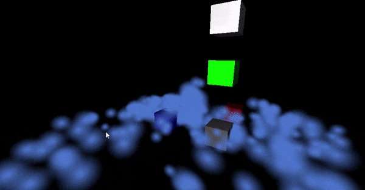

# GameEngine
Game engine using Vulkan and C with a subset of C++. Avoiding external libraries.
This is just for learning purposes.

# Design
* Limited use of external libraries
* Explicit Vulkan instantiation/usage
* Divide code between game/os/render
* Focus on simple C and plain data
* Game dll hot reload
* Procedural game

# Current status
* I have a bare bones working vulkan interface
* I can push meshes to GPU vertex buffer
* I can load textures
* I can load assets (.obj only, using triangles only) with multiple objects
* I can reload game dll during debug with memory intact
* I can generate entities and simulate multiple world areas
* I can render 1 simulation with spatial query
* -I can generated complex 3D ground (low resolution 9 voxels per meter sqr)-
** CPU implementation was working but I will be focus on GPU implementation using computation shader
* Transparent pipeline using oit_weighted (targeted for particle system, opaque objects with transparency not well designed)
** http://casual-effects.blogspot.com/2015/03/implemented-weighted-blended-order.html
** https://github.com/nvpro-samples/vk_order_independent_transparency
* Rudimentary particle system (no generic, just a sample of how to render particles)


# QA
* Why custom compilation?
I learnt how to use msvc clang compiler and only few dlls are created.
I like the simplicity/explicitness of a .bat file with 70 lines to handle compilation.
For debugging I use .clangcomplete and in vim I have shortcuts to build which takes
less time than switching windows.

* Compilation of shaders?
As for now using validator.exe. Everything hardcoded. 


# Dependencies
* For now using Quaternion external lib to test my matrix math

# How to build
```
git clone https://github.com/4Bruno/GameEngine.git
cd GameEngine
cd src
..\debug_build.bat
cd debug
robocopy /mir ..\..\assets assets
win32_platform.exe
```
